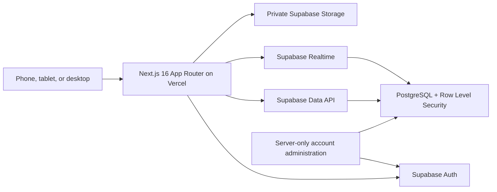

# Kinetic

A private, multi-user calisthenics tracker for accountability partners. The
application is built with Next.js App Router, TypeScript, Tailwind CSS,
Supabase Auth/PostgreSQL/Realtime/Storage, React Hook Form, Zod, and Recharts.
It is intended to run at
[`calisthenics.gillianoagard.com`](https://calisthenics.gillianoagard.com)
without changing the existing apex website at `gillianoagard.com`.

## Architecture



Authorization is enforced in PostgreSQL and Storage policies, not merely in
the interface:

- An authenticated user can create, update, and delete only records they own.
- An accepted accountability partner can read only the categories the owner
  has chosen to share.
- Child rows such as exercise sets inherit access through their owning parent.
- Unrelated accounts cannot discover one another through application tables.
- The Supabase secret or legacy service-role administrative key is never
  exposed to browser code. It is reserved for narrowly scoped server-only
  administration such as final Auth user deletion, if that flow is enabled.

Supabase is the durable source of truth. Browser storage may cache presentation
preferences, but is never the only copy of workout or progress data.

### Route structure

| Route | Purpose |
| --- | --- |
| `/` | Public product landing page |
| `/demo`, `/demo/[view]` | Read-only seeded product preview |
| `/login`, `/register` | Email/password authentication |
| `/forgot-password`, `/reset-password` | Password recovery |
| `/auth/callback` | Supabase email confirmation/recovery callback |
| `/join` | Accept an expiring accountability-partner invitation |
| `/dashboard` | Streaks, weekly volume, records, friend activity, and quick actions |
| `/workouts` | Searchable workout history |
| `/workouts/new`, `/workouts/[id]`, `/workouts/[id]/edit` | Create, inspect, and edit workouts |
| `/skills`, `/skills/new` | Skill ladders, milestones, records, and custom skills |
| `/measurements`, `/measurements/new` | Body measurements and privacy-aware trends |
| `/progress` | Charts, heat map, milestones, and filters |
| `/compare` | Supportive accountability-partner comparison |
| `/goals`, `/goals/new`, `/goals/[id]/edit` | Personal goals |
| `/goals/challenges/new`, `/goals/challenges/[id]` | Create and inspect shared challenges |
| `/activity` | Private partner activity and encouragement |
| `/settings` | Profile, units, privacy, connection, export, and account controls |

### Data model

The SQL in `supabase/migrations/` is the schema source of truth. The core
relations are:

| Table | Responsibility |
| --- | --- |
| `profiles` | Auth-linked identity, display data, timezone, and partner-sharing/privacy choices |
| `friend_connections` | Pending, accepted, or disconnected partner edges |
| `friend_invites` | Expiring, single-use partner invitation codes |
| `workouts` | Workout session header and sharing metadata |
| `workout_exercises` | Ordered exercises within a workout |
| `exercise_sets` | Repetitions, holds, load, assistance, rest, tempo, and completion |
| `exercise_library` | Built-in and user-created exercise definitions |
| `workout_templates` | Reusable workout plans |
| `workout_template_exercises`, `workout_template_sets` | Ordered reusable template details |
| `skills` | Built-in and custom calisthenics skills |
| `skill_progressions` | Ordered, user-defined progression ladder stages |
| `skill_entries` | Skill status, technique, confidence, records, and evidence |
| `body_measurements` | Time-series measurements with explicit visibility |
| `goals` | Personal targets with automatic or manual progress |
| `challenges` | Shared accountability challenges |
| `challenge_members` | Challenge membership and member progress |
| `personal_records` | Auditable exercise/skill bests |
| `activity_feed` | Private, connection-scoped activity events |
| `reactions` | Fixed encouragement reactions, not public comments |
| `notifications` | Private in-app notification state |
| `user_preferences` | Units, theme, workout/week defaults, motion, Realtime/email settings, and accountability targets |

All user-owned tables use UUID primary keys, foreign keys, timestamps, useful
indexes, and Row Level Security. Cascades are limited to rows that have no
meaning without their parent (for example, sets after their workout is
deleted).

Database automation synchronizes finite workout-count goals, exercise/skill
personal-record goals, skill-achievement goals, and `workouts_completed`
challenge-member progress. A recurring workout-frequency goal reports the
current ISO-week count but does not permanently auto-complete; manual goals
remain under the owner's control.

### Implementation phases

1. Foundation: responsive glass design system, navigation, PWA metadata, Auth
   session handling, and Supabase SSR clients.
2. Data layer: relational migrations, ownership helpers, RLS, Storage policies,
   shared TypeScript validation/data contracts, and realistic local seed data.
3. Product features: dashboard, workouts/templates, skills, measurements,
   analytics, comparisons, goals/challenges, activity, and settings.
4. Collaboration: invitation acceptance, per-category privacy, Realtime
   subscriptions, and fixed encouragement reactions.
5. Hardening: validation, destructive-action confirmation, upload limits,
   automated tests, accessibility checks, production build, and
   deployment-readiness documentation. Live deployment verification is an
   operator phase after Supabase, Vercel, and DNS credentials are configured.

### Unit storage and display

`unit_preference` controls input and display units; it does not rewrite stored
history. PostgreSQL stores body weight and training load in kilograms, body
circumferences in centimeters, and workout/template distance in meters.
Imperial input is converted at the write boundary and canonical values are
shown as pounds, inches, or feet in forms, records, activity, and charts.
Repetitions, seconds, percentages, and explicitly user-defined custom units
remain unchanged.

## Prerequisites

- Node.js `22.13+` and below `23` (pinned in `package.json`; validation used
  Node.js `22.14.0`)
- npm
- A Supabase account and project
- A Vercel account
- DNS access for `gillianoagard.com`
- Docker Desktop only if running the full Supabase stack locally
- Supabase CLI, installed with
  [an officially supported method](https://supabase.com/docs/guides/local-development/cli/getting-started)

## Local application setup

1. Install dependencies:

   ```bash
   npm ci
   ```

2. Copy `.env.example` to `.env.local`.

3. Set the project URL and browser-safe publishable key from the Supabase
   project **Connect** dialog or **Settings → API Keys**:

   ```dotenv
   NEXT_PUBLIC_SUPABASE_URL=https://YOUR_PROJECT_REF.supabase.co
   NEXT_PUBLIC_SUPABASE_ANON_KEY=YOUR_SB_PUBLISHABLE_KEY
   NEXT_PUBLIC_SITE_URL=http://localhost:3000
   ```

4. Leave `SUPABASE_SERVICE_ROLE_KEY` unset unless a server-only route explicitly
   needs it. For account deletion, this compatibility-named variable may hold
   an `sb_secret_...` key or a legacy `service_role` key. Copy it only into
   `.env.local`; never paste it into a `NEXT_PUBLIC_*` variable.

5. Start the application:

   ```bash
   npm run dev
   ```

6. Open `http://localhost:3000`.

Next.js reads `.env*` files from the repository root, not from `src/`. Values
whose names start with `NEXT_PUBLIC_` are embedded into browser bundles at
build time, so rebuild after changing them.

## Supabase setup

### 1. Create the project

1. In the [Supabase Dashboard](https://supabase.com/dashboard), create a new
   project in the organization you control.
2. Choose the region nearest the expected users and set a strong, unique
   database password. Store the password in a password manager.
3. Wait for provisioning to finish.
4. From the project **Connect** dialog or **Settings → API Keys**, copy:
   - Project URL → `NEXT_PUBLIC_SUPABASE_URL`
   - publishable key (`sb_publishable_...`; legacy `anon` also works) →
     `NEXT_PUBLIC_SUPABASE_ANON_KEY`
   - secret key (`sb_secret_...`; legacy `service_role` also works) →
     `SUPABASE_SERVICE_ROLE_KEY` only when a server-only administration flow
     needs it

The publishable/legacy anon key is designed to be present in the browser; RLS
is what protects the data. The secret or legacy service-role administrative
key bypasses RLS and must remain secret.

### 2. Apply migrations

Use the CLI so remote migration history stays synchronized:

```bash
supabase login
supabase link --project-ref YOUR_PROJECT_REF
supabase migration list
supabase db push --dry-run
supabase db push
```

The initial chain is deliberately split for review:

1. `202607230001_extensions_and_types.sql`
2. `202607230002_schema.sql`
3. `202607230003_security_and_rls.sql`
4. `202607230004_automation_storage_realtime.sql`
5. `202607230005_catalog.sql`
6. `202607230006_catalog_privacy.sql`
7. `202607230007_initial_progress_sync.sql`
8. `202607230008_accountability_targets.sql`
9. `202607230009_notification_and_photo_privacy.sql`
10. `202607230010_activity_and_goal_hardening.sql`

If the CLI was installed as a project dependency, prefix the commands with
`npx`, for example `npx supabase db push --dry-run`.

`db push` applies unapplied files from `supabase/migrations/` in timestamp
order. Review the dry run before applying it. Do not subsequently make
production schema edits in Table Editor without capturing them in a new
migration; otherwise migration history will drift.

For local database verification:

```bash
supabase start
supabase db reset
supabase db lint --local
supabase test db
```

`supabase db reset` is intentionally destructive to the **local** database. Do
not run `supabase db reset --linked` against production.

`supabase test db` runs the transactional pgTAP suite under
`supabase/tests/database/`, including owner/partner/unrelated-user RLS denial
cases. It requires the local stack to be running.

After applying the migrations, audit the protection flags in SQL Editor:

```sql
select tablename, rowsecurity
from pg_catalog.pg_tables
where schemaname = 'public'
order by tablename;

select schemaname, tablename, policyname, roles, cmd
from pg_catalog.pg_policies
where schemaname in ('public', 'storage')
order by schemaname, tablename, policyname;
```

Every exposed application table must report `rowsecurity = true`. These queries
confirm that policies exist, but the SQL Editor runs with elevated access and
cannot prove that policies deny a normal user; perform the two-user denial test
described below as well.

### 3. Configure Storage

The migrations create two private buckets and their `storage.objects` RLS
policies:

| Bucket | Maximum object size | Allowed MIME types |
| --- | ---: | --- |
| `avatars` | 5 MiB | `image/jpeg`, `image/png`, `image/webp`, `image/avif` |
| `progress-media` | 50 MiB | the avatar image types plus `video/mp4`, `video/webm`, and `video/quicktime` |

Avatar paths use `<auth.uid()>/<file>`. Progress-media paths use
`<auth.uid()>/<private|shared>/<entity-or-date>/<file>`. A progress-media
partner read still requires an accepted connection, the owner's
`progress_photo_visibility = 'partner'` preference, and a partner-visible
workout, skill entry, or measurement that references the exact object. A
`shared` path alone is not authorization.

Measurement-photo sharing is independent of measurement-value sharing.
`get_partner_measurement_photo_refs(uuid)` returns only `measured_at` and
shared photo paths; it requires an accepted connection, the owner's
`progress_photo_visibility = 'partner'` setting, a partner-visible measurement
row, and a path in that owner's `shared` subtree.

In **Storage**, verify that:

- each bucket is private;
- the bucket-level file-size limit matches the migration;
- allowed MIME types are restricted to the image/video types used by the app;
- object names follow the owner/privacy path convention above;
- owners can upload/update/delete their own objects;
- an accepted friend can read only the avatar currently attached to the
  owner's profile; no separate avatar-sharing preference exists;
- progress media additionally requires the owner's
  `progress_photo_visibility = 'partner'` setting and an exact reference from a
  partner-visible source record.

Do not make a progress-photo bucket public. Display private media with
short-lived signed URLs. Supabase's project-wide upload limit must be at least
as large as the stricter bucket limit; see
[Storage file limits](https://supabase.com/docs/guides/storage/uploads/file-limits).

### 4. Configure Auth

In **Authentication → Providers → Email**:

1. Keep email/password sign-in enabled.
2. Enable **Confirm email** for production.
3. Set a minimum password length of at least 10; enable leaked-password
   protection if the selected Supabase plan provides it.
4. In **URL Configuration**, set:

   ```text
   Site URL: https://calisthenics.gillianoagard.com
   Additional redirect URL: http://localhost:3000/**
   Additional redirect URL: https://calisthenics.gillianoagard.com/auth/callback
   Additional redirect URL: https://calisthenics.gillianoagard.com/reset-password
   ```

5. Add the exact Vercel preview pattern only if preview deployments must use
   Auth, for example
   `https://*-YOUR_VERCEL_TEAM_SLUG.vercel.app/**`. Exact production paths are
   safer than a production wildcard. See Supabase's
   [redirect URL guidance](https://supabase.com/docs/guides/auth/redirect-urls).

When `NEXT_PUBLIC_SITE_URL` is the production subdomain, a generated Vercel
preview URL is suitable for public-page and build smoke tests only. Full Auth
testing must wait for the custom domain, or the preview deployment must use a
preview-specific site URL that also appears in Supabase's redirect allow list.
6. Configure a custom SMTP provider before inviting real users. Supabase's
   default email sender is intended for testing and is rate-limited.
7. Send a registration, confirmation, and password-reset email to a real
   mailbox and verify that every link returns to the production subdomain.

### 5. Verify Realtime

The migrations add only the collaboration tables needed by the application to the
`supabase_realtime` publication. Verify them in **Database → Publications →
supabase_realtime**. If a required table is absent, add it in a new migration:

```sql
alter publication supabase_realtime add table public.activity_feed;
```

The expected publication contains `workouts`, `skill_entries`,
`personal_records`, `goals`, `activity_feed`, `reactions`,
`challenge_members`, and `notifications`. Audit it with:

```sql
select schemaname, tablename
from pg_catalog.pg_publication_tables
where pubname = 'supabase_realtime'
order by schemaname, tablename;
```

Do not subscribe to the entire public schema. Postgres Changes evaluates RLS
for subscribers, so an event is delivered only when the signed-in user can
select the row. Keep subscriptions filtered and remove channels when a
component unmounts.

### 6. Demo data

Local seed data is loaded after migrations by:

```bash
supabase db reset
```

The local demonstration accounts are:

| User | Email | Password |
| --- | --- | --- |
| Ava Martin | `ava.martin@demo.calisthenics.local` | `CalisthenicsDemo!26` |
| Noah Chen | `noah.chen@demo.calisthenics.local` | `CalisthenicsDemo!26` |

To seed a disposable remote development or staging project:

```bash
supabase db push --include-seed
```

Never use `--include-seed` on production. Demo credentials are test-only and
must not be reused for real accounts.

To remove demo data from a disposable remote project, first confirm the target
project and review exactly which accounts would be selected:

```sql
select p.id, p.display_name, u.email
from public.profiles p
join auth.users u on u.id = p.id
where p.is_demo
order by u.email;
```

Then open `supabase/demo_cleanup.sql` and run it in **SQL Editor**. It deletes
only Auth users whose linked profiles have `is_demo = true`; foreign-key
cascades remove their owned demonstration rows. Run it before inviting real
users if demo data was ever loaded into the intended production project. Do
not substitute a broad table truncate.

## Testing and quality gates

Run the deterministic checks before every production deployment:

```bash
npm run check
```

`npm run check` runs lint, TypeScript, the non-watch test suite, and the
production build. Use `npm run test:watch` while developing. Vitest is intentionally
used for synchronous components and pure domain logic; async Server Components
and full Auth/RLS behavior require browser and database integration tests.

`npm audit --omit=dev` should also return zero findings. The package overrides
pin patched PostCSS and Sharp releases beyond the versions currently requested
by Next.js 16.2.11; re-evaluate and remove those overrides after a future
Next.js release incorporates the patched dependency ranges.

### Verification status

The repository-level quality gates can run without cloud credentials. Live
Auth, cross-device persistence, RLS denial, Realtime, Storage, remote
migrations, Vercel deployment, DNS, and HTTPS require a configured Supabase
project, the local Supabase/Docker stack or remote credentials, Vercel access,
and DNS access. Treat the acceptance and production smoke lists below as
required operator checks until those resources are connected; this README does
not claim they were completed in an unconfigured environment.

The relevant scripts are:

```json
{
  "scripts": {
    "test": "vitest run",
    "test:watch": "vitest",
    "check": "npm run lint && npm run typecheck && npm run test && npm run build"
  }
}
```

### Local acceptance test

1. Create Alice in one normal browser profile and Bob in an incognito profile.
2. Confirm both email addresses and sign in.
3. Alice creates an invitation; Bob accepts it.
4. Alice logs a workout with multiple exercises/sets, updates a skill, records
   a measurement, and creates a goal.
5. Verify Alice's data appears after signing out and signing in on another
   device.
6. Verify Bob sees allowed shared activity without a manual refresh.
7. Hide Alice's detailed measurements and progress photos; verify Bob can no
   longer fetch them, including by directly reusing a previously observed ID.
8. Using Bob's authenticated Supabase client, attempt to update and delete
   Alice's workout, exercise set, skill entry, and measurement. Every mutation
   must affect zero rows or return an authorization error.
9. Create an unrelated third account. Verify it cannot read either profile's
   private records or discover their connection.
10. Disconnect the partners and verify shared reads stop immediately.

### Production smoke test

- Registration, email confirmation, login, logout, persistent session, and
  password reset all use the production subdomain.
- Dashboard and charts have usable empty, loading, success, and failure states.
- A workout created on a phone appears on a desktop session.
- Partner activity arrives in real time and respects RLS.
- Image/video uploads reject disallowed types and oversize files.
- Export contains only the signed-in user's permitted data.
- Destructive actions require confirmation.
- Keyboard focus is visible, dialogs trap/restore focus, and reduced-motion
  preferences are honored.
- Pages have no horizontal overflow at 320 px, 768 px, 1024 px, and a wide
  desktop viewport.
- `npm run build` succeeds with the exact production environment variables.

## Deploy to Vercel

### 1. Create the deployment

1. Push the repository to a private Git provider repository.
2. In [Vercel](https://vercel.com/new), import that repository.
3. Keep **Framework Preset: Next.js**, **Root Directory: repository root**,
   **Install Command: `npm ci`**, and **Build Command: `npm run build`**.
4. Select Node.js `22.x`; `package.json` enforces version `22.13.0` or newer
   and below `23`.
5. Add these variables to the **Production** environment:

   ```dotenv
   NEXT_PUBLIC_SUPABASE_URL=https://YOUR_PROJECT_REF.supabase.co
   NEXT_PUBLIC_SUPABASE_ANON_KEY=YOUR_SB_PUBLISHABLE_KEY
   NEXT_PUBLIC_SITE_URL=https://calisthenics.gillianoagard.com
   SUPABASE_SERVICE_ROLE_KEY=YOUR_SB_SECRET_OR_LEGACY_SERVICE_ROLE_KEY
   ```

6. `SUPABASE_SERVICE_ROLE_KEY` is required by the account-deletion endpoint.
   Mark it sensitive and scope it to Production. Never expose it to browser
   code or to Preview deployments backed by production data.
7. Deploy and use the generated `*.vercel.app` URL for public/build smoke
   checks. Perform full Auth checks on the custom domain unless Preview has its
   own site URL and matching Supabase redirect configuration.

Vercel detects Next.js without a `vercel.json`; no custom deployment
configuration is required. Public environment variables are frozen into the
build, so redeploy after changing them.

### 2. Attach only the subdomain

In **Vercel Project → Settings → Domains**, add:

```text
calisthenics.gillianoagard.com
```

Do **not** add, transfer, redirect, or change `gillianoagard.com` or `www`.
Vercel will show the exact required record for this project. At the DNS
provider for `gillianoagard.com`, create:

| Field | Value |
| --- | --- |
| Type | `CNAME` |
| Host / Name | `calisthenics` |
| Target / Value | the exact project-specific Vercel target shown in Domains |
| TTL | `Auto` or the provider default |

Current Vercel projects may receive a unique target such as
`<id>.vercel-dns-###.com`; use the value Vercel displays instead of copying a
generic target from an old guide. This changes only the `calisthenics`
subdomain and leaves the apex site untouched. Remove a conflicting
`calisthenics` A/AAAA/CNAME record if one exists, but do not alter any other
DNS record. With Cloudflare DNS, use **DNS only** during initial verification.

Vercel documents the flow in
[Adding and configuring a custom domain](https://vercel.com/docs/domains/working-with-domains/add-a-domain).
DNS propagation can take time. Check from a terminal:

```bash
nslookup -type=CNAME calisthenics.gillianoagard.com
```

Then return to Vercel Domains and wait for **Valid Configuration**.

### 3. HTTPS and canonical URLs

After DNS verifies, Vercel automatically provisions and renews the TLS
certificate. Wait for the domain to show a valid certificate, then verify:

```bash
curl -I https://calisthenics.gillianoagard.com
```

The request should succeed over HTTPS without a certificate warning. Update
Supabase's Site URL/redirect allow list and the Vercel
`NEXT_PUBLIC_SITE_URL`, redeploy, and repeat the complete Auth smoke test.
Never configure the apex domain to redirect to this application.

## Data export and account deletion

Data export runs as the signed-in user and adds explicit owner filters on top
of normal RLS. JSON is the lossless all-table format. CSV exports one selected
relation at a time (for example workouts, exercises, sets, skills,
measurements, goals, or records), with every cell quoted and spreadsheet
formula prefixes neutralized. Private media remains represented by its private
Storage object path in the owning row; the export never turns it into a
permanent public URL. The application resolves those paths to short-lived
signed URLs only when displaying permitted media.

The implemented account-deletion endpoint is materially destructive. It:

1. requires a fresh authenticated session and explicit destructive-action
   confirmation;
2. deletes private Storage objects owned by that user, stopping before Auth
   deletion if media cleanup fails;
3. calls `auth.admin.deleteUser` only from a server-only handler using the
   secret or legacy service-role administrative key;
4. relies on foreign-key cascades from the Auth/profile deletion to remove the
   user's application rows and connection edge; and
5. returns an empty success response without exposing the administrative key.

Storage and Auth/database deletion cannot be one cross-service transaction, so
operators should retain backups and review failed deletion logs. Do not call an
Auth admin API from a Client Component.

## Security checklist

- [ ] RLS is enabled on every exposed application table and Storage object.
- [ ] `anon` has no broad read/write policies.
- [ ] Ownership is checked on `INSERT`, `UPDATE`, and `DELETE`; child-table
      policies verify the owner through the parent.
- [ ] Friend reads require an accepted connection and the owner's current
      visibility preference.
- [ ] Views exposed to clients use `security_invoker = true` or have access
      revoked from `anon`/`authenticated`.
- [ ] Invitation codes are unguessable, expire, are single-use, and are
      rate-limited.
- [ ] All server mutations authenticate and authorize independently of page
      middleware.
- [ ] Zod validates untrusted input on the server as well as in forms.
- [ ] Upload MIME type, extension, size, path owner, and record visibility are
      validated; buckets remain private.
- [ ] User-authored text is rendered as text, not unsanitized HTML.
- [ ] CSV exports quote every cell and neutralize spreadsheet-formula prefixes.
- [ ] The secret or legacy service-role administrative key exists only in
      protected server environments and never in logs, screenshots, browser
      bundles, or exported data.
- [ ] Production email uses custom SMTP; Auth and invitation endpoints have
      practical rate limits and bot protection.
- [ ] Dependency alerts, Supabase logs, Vercel logs, backups, and recovery
      procedures are reviewed before launch.
- [ ] RLS denial tests are run with two authenticated users and one unrelated
      user after every policy change.

## Accountability score

If enabled, the weekly accountability score is transparent and capped at 100:

- **Weekly-plan completion — 40 points:** completed workouts ÷ the user's
  weekly workout target, capped at 1, multiplied by 40.
- **Consistency — 25 points:** distinct calendar days containing a completed
  workout ÷ the user's weekly workout target, capped at 1, multiplied by 25.
- **Skill practice — 20 points:** skill-progress check-ins recorded this week ÷
  the user's weekly skill-practice target, capped at 1, multiplied by 20.
- **Complete logging — 15 points:** completed workouts containing the required
  start/end times and at least one set ÷ all completed workouts that week,
  multiplied by 15.

Both weekly targets are explicit, user-controlled values in Settings (1–14);
the narrow `get_accountability_targets()` RPC shares only those two targets
with an accepted partner. When a logging denominator is zero, that category
contributes zero points; points are not silently redistributed. Each visible
component and the final total are rounded for display. This score is an
accountability aid, not a fitness ranking.

Skill completion percentages follow a similarly explicit rule:

```text
completed stages / total stages in that skill's defined ladder × 100
```

No percentage is shown for a skill without a defined progression ladder.

## Operational notes

- Treat production and preview as separate environments. Prefer a separate
  Supabase project for Preview deployments.
- Rotate a credential immediately if it is ever committed or exposed; removing
  it from Git history alone does not make it safe.
- Back up production before destructive migrations.
- Use new timestamped migrations for schema changes, test with
  `supabase db reset`, review `supabase db push --dry-run`, then deploy.
- Consult the current
  [Supabase migration workflow](https://supabase.com/docs/guides/local-development/cli-workflows)
  and [Vercel custom-domain guide](https://vercel.com/docs/domains/set-up-custom-domain)
  when infrastructure behavior changes.
